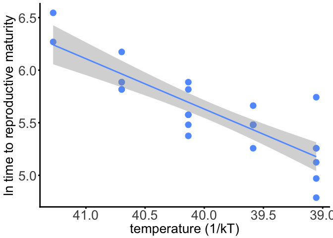
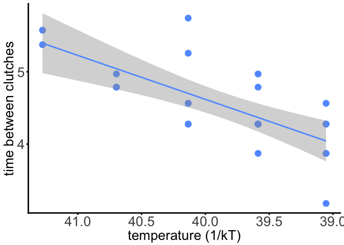
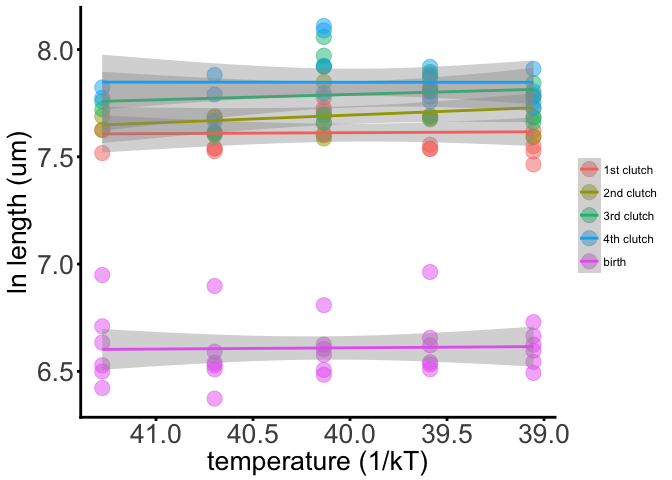
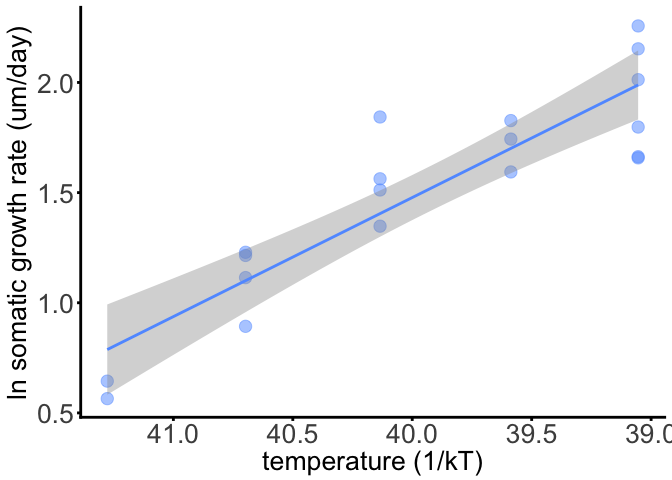
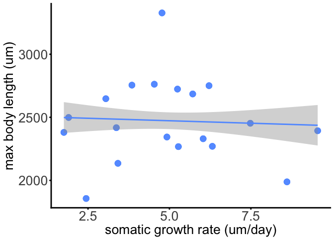

# Temperature size rule results


### Background

Something here about the TSR being the third 'universal' response to warming. However, the mechanisms responsible for this widespread pattern are unknown blah blah blah, particularly w/r/t whether being smaller at warmer temperatures is associated with higher fitness. Or else why would this pattern be so prevalent in nature?


```r
data3 <- read_csv("/Users/Joey/Documents/Daph-TSR/data-processed/data3.csv")
```


### Reproductive rate
How does reproductive rate vary with temperature?
<!-- -->


```r
data3 %>% 
	filter(unique_id != "K_16") %>% ## something weird is going on here!
	mutate(inverse_temp = (1/(.00008617*(temperature+273.15)))) %>%
	do(tidy(lm(log(time_to_first_clutch) ~ inverse_temp, data = .), conf.int = TRUE)) %>%
	knitr::kable(.)
```


term               estimate   std.error   statistic   p.value      conf.low    conf.high
-------------  ------------  ----------  ----------  --------  ------------  -----------
(Intercept)     -13.5224258   2.3825210    -5.67568   7.6e-06   -18.4397074   -8.6051442
inverse_temp      0.4788195   0.0596525     8.02681   0.0e+00     0.3557027    0.6019362


Time between clutches

<!-- -->


```r
## time between clutches
data3 %>% 
	filter(unique_id != "K_16") %>% ## something weird is going on here!
	mutate(inverse_temp = (1/(.00008617*(temperature+273.15)))) %>%
	do(tidy(lm(log(time_btw_1_2) ~ inverse_temp, data = .), conf.int = TRUE)) %>%
	knitr::kable(.)
```


term               estimate   std.error   statistic     p.value      conf.low    conf.high
-------------  ------------  ----------  ----------  ----------  ------------  -----------
(Intercept)     -19.7276177   5.1098596   -3.860697   0.0008466   -30.3248179   -9.1304174
inverse_temp      0.6086533   0.1281431    4.749792   0.0000967     0.3429007    0.8744058

### Body size

<!-- -->

### Somatic growth rates


```r
## get to somatic growth rate by taking the difference in length at 1st clutch and length at birth, divided by the days to first clutch

data3 %>% 
	filter(unique_id != "K_16") %>% ## something weird is going on here!
	mutate(inverse_temp = (1/(.00008617*(temperature+273.15)))) %>%
	mutate(somatic_growth_rate = ((length_at_1st_clutch - length_at_birth_um)/time_to_first_clutch)) %>%
	ggplot(data = ., aes(x = inverse_temp, y = log(somatic_growth_rate), label = id)) + geom_point(size = 4, color = "#619CFF", alpha = 0.5) +
	geom_smooth(method = "lm", color = "#619CFF") +
	scale_x_reverse() + xlab("temperature (1/kT)") + ylab("ln somatic growth rate (um/day)") +
	theme_minimal() + 
	theme(axis.text.y   = element_text(size=20),
				axis.text.x   = element_text(size=20),
				axis.title.y  = element_text(size=20),
				axis.title.x  = element_text(size=20),
				panel.background = element_blank(),
				panel.grid.major = element_blank(), 
				panel.grid.minor = element_blank(),
				axis.line = element_line(colour = "black"),
				axis.ticks = element_line(size = 1),
				legend.title = element_blank()) +
	theme(panel.border = element_blank(), axis.line = element_line(colour="black", size=1, lineend="square"))
```

<!-- -->


```r
data3 %>% 
	filter(unique_id != "K_16") %>% ## something weird is going on here!
	mutate(inverse_temp = (-1/(.00008617*(temperature+273.15)))) %>%
	mutate(somatic_growth_rate = ((length_at_1st_clutch - length_at_birth_um)/time_to_first_clutch)) %>%
do(tidy(lm(log(somatic_growth_rate) ~ inverse_temp, data = .), conf.int = TRUE)) %>%
	knitr::kable(.)
```


term              estimate   std.error   statistic   p.value     conf.low    conf.high
-------------  -----------  ----------  ----------  --------  -----------  -----------
(Intercept)     23.0958538   2.5278438    9.136583     1e-07   17.7625697   28.4291380
inverse_temp     0.5404576   0.0632702    8.542051     1e-07    0.4069691    0.6739461

### Size rate trade-off??

<!-- -->
