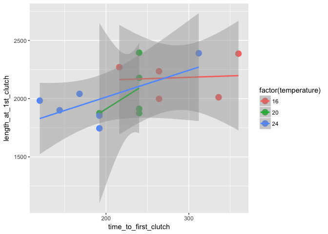
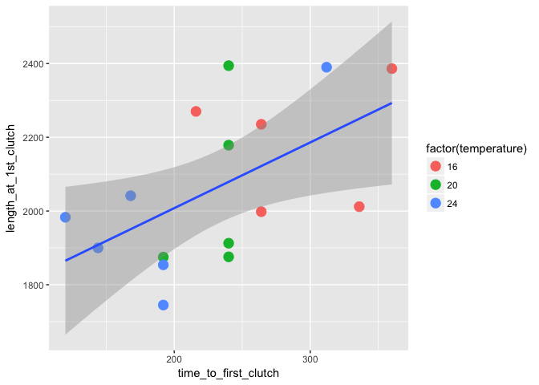

# Temperature size rule results


### Background

Something here about the TSR being the third 'universal' response to warming. However, the mechanisms responsible for this widespread pattern are unknown blah blah blah, particularly w/r/t whether being smaller at warmer temperatures is associated with higher fitness. Or else why would this pattern be so prevalent in nature?


```r
data3 <- read_csv("/Users/Joey/Documents/Daph-TSR/data-processed/data3.csv")
```


### Reproductive rate
How does reproductive rate vary with temperature?
<!-- -->


```r
data3 %>% 
	filter(unique_id != "K_16") %>% ## something weird is going on here!
	mutate(inverse_temp = (1/(.00008617*(temperature+273.15)))) %>%
	do(tidy(lm(log(time_to_first_clutch) ~ inverse_temp, data = .), conf.int = TRUE)) %>%
	knitr::kable(.)
```


term               estimate   std.error   statistic   p.value      conf.low    conf.high
-------------  ------------  ----------  ----------  --------  ------------  -----------
(Intercept)     -13.5224258   2.3825210    -5.67568   7.6e-06   -18.4397074   -8.6051442
inverse_temp      0.4788195   0.0596525     8.02681   0.0e+00     0.3557027    0.6019362


Time between clutches

<!-- -->


```r
## time between clutches
data3 %>% 
	filter(unique_id != "K_16") %>% ## something weird is going on here!
	mutate(inverse_temp = (1/(.00008617*(temperature+273.15)))) %>%
	do(tidy(lm(log(time_btw_1_2) ~ inverse_temp, data = .), conf.int = TRUE)) %>%
	knitr::kable(.)
```


term               estimate   std.error   statistic     p.value      conf.low    conf.high
-------------  ------------  ----------  ----------  ----------  ------------  -----------
(Intercept)     -19.7276177   5.1098596   -3.860697   0.0008466   -30.3248179   -9.1304174
inverse_temp      0.6086533   0.1281431    4.749792   0.0000967     0.3429007    0.8744058

### Body size

<!-- -->

### Somatic growth rates

<!-- -->


```r
data3 %>% 
	filter(unique_id != "K_16") %>% ## something weird is going on here!
	mutate(inverse_temp = (-1/(.00008617*(temperature+273.15)))) %>%
	mutate(somatic_growth_rate = ((length_at_1st_clutch - length_at_birth_um)/time_to_first_clutch)) %>%
do(tidy(lm(log(somatic_growth_rate) ~ inverse_temp, data = .), conf.int = TRUE)) %>%
	knitr::kable(.)
```


term              estimate   std.error   statistic   p.value     conf.low    conf.high
-------------  -----------  ----------  ----------  --------  -----------  -----------
(Intercept)     23.0958538   2.5278438    9.136583     1e-07   17.7625697   28.4291380
inverse_temp     0.5404576   0.0632702    8.542051     1e-07    0.4069691    0.6739461

### Size rate trade-off??

<!-- -->

#### Body size over time
<!-- -->


#### Minimum adult body size
<!-- -->


#### Maximum adult body size
<!-- -->

#### Mean adult body size
<!-- -->

#### Next step: bring in the fecundity data to merge with the size data


```r
lengths_clean <- lengths_all_adult %>% 
	mutate(unique_id = str_replace(unique_id, "2N1.2", "N")) %>% 
	mutate(unique_id = str_replace(unique_id, "2N1.3", "N")) %>%
	mutate(unique_id = str_replace(unique_id, "2N1.4", "N")) %>% 
	mutate(unique_id = str_replace(unique_id, "2N1.8", "N")) %>%
	mutate(unique_id = str_replace(unique_id, "2N1.5", "N")) %>% 
	mutate(unique_id = str_replace(unique_id, "2N1.1", "N")) %>% 
	separate(unique_id, into = c("letter", "temp"), remove = FALSE) %>% 
	mutate(life_stage = ifelse(life_stage == "1", "clutch_1", life_stage)) %>% 
	mutate(life_stage = ifelse(life_stage == "2", "clutch_2", life_stage)) %>%
	mutate(life_stage = ifelse(life_stage == "3", "clutch_3", life_stage)) %>%
	mutate(life_stage = ifelse(life_stage == "4", "clutch_4", life_stage)) %>% 
	rename(clutch_number = life_stage)

	
data_raw <- read_csv("/Users/Joey/Documents/Daph-TSR/data-raw/DAPH-TSR-clutches.csv")
```

```
## Parsed with column specification:
## cols(
##   ID = col_character(),
##   temperature = col_integer(),
##   clutch_number = col_character(),
##   individuals = col_integer(),
##   clutch_date = col_character(),
##   sample_date = col_character()
## )
```

```r
v2_babies <- data_raw %>% 
	filter(grepl("V2", ID)) %>% 
	separate(ID, into = c("V", "letter"), sep = 2) %>% 
	unite(unique_id, letter, temperature, sep = "_")


data_raw %>% 
	filter(str_detect(ID, "N")) %>% 
	arrange(temperature, clutch_number)### come back to filling out the clutch number business here, it's clearly not totally complete!
```

```
## # A tibble: 14 × 6
##       ID temperature clutch_number individuals   clutch_date   sample_date
##    <chr>       <int>         <chr>       <int>         <chr>         <chr>
## 1    V2N          16      clutch_1           2  July 19 2016 August 5 2016
## 2    V2N          16      clutch_2           4  July 23 2016 August 5 2016
## 3    V2N          16      clutch_3           0 August 1 2016 August 8 2016
## 4    V2N          16      clutch_4           9 August 4 2016 August 5 2016
## 5    V2N          20      clutch_1          14  July 13 2016  July 18 2016
## 6    V2N          20      clutch_1          17  July 16 2016  July 18 2016
## 7    V2N          20      clutch_2          15  July 19 2016 August 5 2016
## 8    V2N          20      clutch_3           5  July 21 2016 August 5 2016
## 9    V2N          24      clutch_1           9  July 17 2016          <NA>
## 10   V2N          24      clutch_2          18  July 18 2016          <NA>
## 11   V2N          24      clutch_3           5  July 20 2016 August 5 2016
## 12   V2N          24      clutch_3          NA  July 20 2016          <NA>
## 13   V2N          24      clutch_4           0  July 22 2016 August 5 2016
## 14   V2N          24      clutch_4          NA  July 22 2016          <NA>
```

```r
all <- left_join(lengths_clean, v2_babies, by = c("unique_id", "clutch_number"))

ggplot(data = all, aes(x = length, y = individuals, color = factor(temperature))) + geom_point(size = 4)
```

```
## Warning: Removed 258 rows containing missing values (geom_point).
```

<!-- -->

For a given temperature, plot size vs. number of individuals


```r
all %>% 
filter(individuals != 0) %>% 
ggplot(data = ., aes(x = length, y = individuals, color = factor(temperature))) + geom_point(size = 4) + facet_wrap( ~ temperature)
```

<!-- -->
How do we answer the question: is being smaller at a given temperature maximizing your fitness?

```r
all %>% 
	filter(individuals != 0) %>% 
	# filter(temperature == 24) %>%
ggplot(data = ., aes(x = length, y = individuals, color = factor(temperature))) + geom_point(size = 4) + geom_smooth(method = "lm") +
	facet_wrap( ~ temperature, scales = "free")
```

<!-- -->
	

```r
all %>% 
	filter(temperature == 24) %>%
	filter(individuals != 0) %>% 
ggplot(data = ., aes(x = length, y = individuals)) + geom_point(aes(color = factor(letter)), size = 4) + geom_smooth(method = "lm") +
	facet_wrap( ~ temperature)
```

<!-- -->


Ok so what I think we are seeing is that on a per individual clutch basis, there is still a positive relationship between body size and number of individuals per clutch...which I guess is not surprising...but maybe a more accurate measure of fitness is the number of offspring per unit time??? Maybe I should have looked at total lifetime reproductive output, not the number of offspring per clutch? It's clear that the warmer invidividuals pump through more clutches per unit time. Maybe I should look at whether within a temperature, you get through more clutches if you are smaller?


Maybe I should take the time to first reproduction and average clutch size and somehow plot that versus size at temperature?


```r
data3_select <- data3 %>% 
	select(id, temperature, time_to_first_clutch, length_at_1st_clutch, length_at_2nd_clutch_um) %>% 
	mutate(id = str_replace(id, "2N1.2", "N")) %>% 
	mutate(id = str_replace(id, "2N1.3", "N")) %>%
	mutate(id = str_replace(id, "2N1.1", "N")) %>%
	mutate(id = str_replace(id, "2N1.4", "N")) %>%
	mutate(id = str_replace(id, "2N1.5", "N"))
	
	


data3_select %>% 
	filter(time_to_first_clutch != 1176) %>% 
	filter(temperature > 13) %>% 
	ggplot(data = ., aes(x = time_to_first_clutch, y = length_at_1st_clutch, color = factor(temperature), label = id)) + geom_point(size = 4) + geom_smooth(method = "lm")
```

```
## Warning: Removed 3 rows containing non-finite values (stat_smooth).
```

```
## Warning: Removed 3 rows containing missing values (geom_point).
```

<!-- -->

```r
data3_select %>% 
	filter(time_to_first_clutch != 1176) %>% 
	filter(temperature > 13) %>% 
	ggplot(data = ., aes(x = time_to_first_clutch, y = length_at_1st_clutch)) + geom_point(aes(color = factor(temperature)), size = 4) + geom_smooth(method = "lm")
```

```
## Warning: Removed 3 rows containing non-finite values (stat_smooth).

## Warning: Removed 3 rows containing missing values (geom_point).
```

<!-- -->

```r
tidy(lm(length_at_1st_clutch ~ time_to_first_clutch, data = data3_select), conf.int = TRUE)
```

```
##                   term     estimate  std.error statistic      p.value
## 1          (Intercept) 1877.3353429 82.8180744 22.668184 9.579253e-17
## 2 time_to_first_clutch    0.5647173  0.2083568  2.710338 1.277848e-02
##       conf.low    conf.high
## 1 1705.5811688 2049.0895169
## 2    0.1326119    0.9968228
```

```r
summary(lm(length_at_1st_clutch ~ time_to_first_clutch, data = data3_select))
```

```
## 
## Call:
## lm(formula = length_at_1st_clutch ~ time_to_first_clutch, data = data3_select)
## 
## Residuals:
##     Min      1Q  Median      3Q     Max 
## -430.49 -133.07  -54.05  176.50  381.44 
## 
## Coefficients:
##                       Estimate Std. Error t value Pr(>|t|)    
## (Intercept)          1877.3353    82.8181   22.67   <2e-16 ***
## time_to_first_clutch    0.5647     0.2084    2.71   0.0128 *  
## ---
## Signif. codes:  0 '***' 0.001 '**' 0.01 '*' 0.05 '.' 0.1 ' ' 1
## 
## Residual standard error: 221.5 on 22 degrees of freedom
##   (14 observations deleted due to missingness)
## Multiple R-squared:  0.2503,	Adjusted R-squared:  0.2162 
## F-statistic: 7.346 on 1 and 22 DF,  p-value: 0.01278
```
