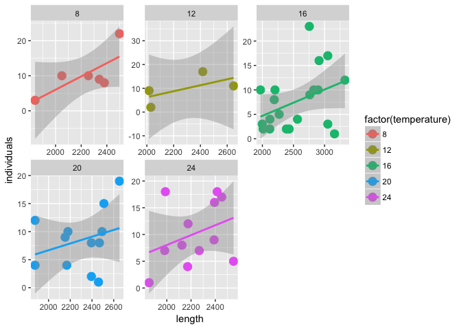

# Temperature size rule results


### Background

Something here about the TSR being the third 'universal' response to warming. However, the mechanisms responsible for this widespread pattern are unknown blah blah blah, particularly w/r/t whether being smaller at warmer temperatures is associated with higher fitness. Or else why would this pattern be so prevalent in nature?


```r
data3 <- read_csv("/Users/Joey/Documents/Daph-TSR/data-processed/data3.csv")
```


### Reproductive rate
How does reproductive rate vary with temperature?
<!-- -->


```r
data3 %>% 
	filter(unique_id != "K_16") %>% ## something weird is going on here!
	mutate(inverse_temp = (1/(.00008617*(temperature+273.15)))) %>%
	do(tidy(lm(log(time_to_first_clutch) ~ inverse_temp, data = .), conf.int = TRUE)) %>%
	knitr::kable(.)
```


term               estimate   std.error   statistic   p.value      conf.low    conf.high
-------------  ------------  ----------  ----------  --------  ------------  -----------
(Intercept)     -13.5224258   2.3825210    -5.67568   7.6e-06   -18.4397074   -8.6051442
inverse_temp      0.4788195   0.0596525     8.02681   0.0e+00     0.3557027    0.6019362


Time between clutches

<!-- -->


```r
## time between clutches
data3 %>% 
	filter(unique_id != "K_16") %>% ## something weird is going on here!
	mutate(inverse_temp = (1/(.00008617*(temperature+273.15)))) %>%
	do(tidy(lm(log(time_btw_1_2) ~ inverse_temp, data = .), conf.int = TRUE)) %>%
	knitr::kable(.)
```


term               estimate   std.error   statistic     p.value      conf.low    conf.high
-------------  ------------  ----------  ----------  ----------  ------------  -----------
(Intercept)     -19.7276177   5.1098596   -3.860697   0.0008466   -30.3248179   -9.1304174
inverse_temp      0.6086533   0.1281431    4.749792   0.0000967     0.3429007    0.8744058

### Body size

<!-- -->

### Somatic growth rates

<!-- -->


```r
data3 %>% 
	filter(unique_id != "K_16") %>% ## something weird is going on here!
	mutate(inverse_temp = (-1/(.00008617*(temperature+273.15)))) %>%
	mutate(somatic_growth_rate = ((length_at_1st_clutch - length_at_birth_um)/time_to_first_clutch)) %>%
do(tidy(lm(log(somatic_growth_rate) ~ inverse_temp, data = .), conf.int = TRUE)) %>%
	knitr::kable(.)
```


term              estimate   std.error   statistic   p.value     conf.low    conf.high
-------------  -----------  ----------  ----------  --------  -----------  -----------
(Intercept)     23.0958538   2.5278438    9.136583     1e-07   17.7625697   28.4291380
inverse_temp     0.5404576   0.0632702    8.542051     1e-07    0.4069691    0.6739461

### Size rate trade-off??

<!-- -->

Body size over time
<!-- -->


Minimum adult body size
<!-- -->


Maximum adult body size
<!-- -->

Mean adult body size
<!-- -->

Next step: bring in the fecundity data to merge with the size data


```r
lengths_clean <- lengths_all_adult %>% 
	mutate(unique_id = str_replace(unique_id, "2N1.2", "N")) %>% 
	mutate(unique_id = str_replace(unique_id, "2N1.3", "N")) %>%
	mutate(unique_id = str_replace(unique_id, "2N1.4", "N")) %>% 
	mutate(unique_id = str_replace(unique_id, "2N1.8", "N")) %>%
	mutate(unique_id = str_replace(unique_id, "2N1.5", "N")) %>% 
	mutate(unique_id = str_replace(unique_id, "2N1.1", "N")) %>% 
	separate(unique_id, into = c("letter", "temperature"), remove = FALSE)

data_raw <- read_csv("/Users/Joey/Documents/Daph-TSR/data-raw/DAPH-TSR-clutches.csv")
```

```
## Parsed with column specification:
## cols(
##   ID = col_character(),
##   temperature = col_integer(),
##   clutch_number = col_integer(),
##   individuals = col_integer(),
##   clutch_date = col_character(),
##   sample_date = col_character()
## )
```

```r
v2_babies <- data_raw %>% 
	filter(grepl("V2", ID)) %>% 
	separate(ID, into = c("V", "letter"), sep = 2) %>% 
	unite(unique_id, letter, temperature, sep = "_")

all <- left_join(lengths_clean, v2_babies, by = "unique_id")

ggplot(data = all, aes(x = length, y = individuals, color = factor(temperature))) + geom_point(size = 4)
```

```
## Warning: Removed 248 rows containing missing values (geom_point).
```

<!-- -->

For a given temperature, plot size vs. number of individuals


```r
all %>% 
	# filter(temperature == 24) %>% 
ggplot(data = ., aes(x = length, y = individuals, color = factor(temperature))) + geom_point(size = 4) + facet_wrap( ~ temperature)
```

```
## Warning: Removed 248 rows containing missing values (geom_point).
```

<!-- -->


```r
all %>% 
	filter(letter == "F") %>%
ggplot(data = ., aes(x = length, y = individuals, color = factor(temperature))) + geom_point(size = 4) ### something weird is going on here w/r/t number of individuals getting copied too many times.
```

<!-- -->
	
